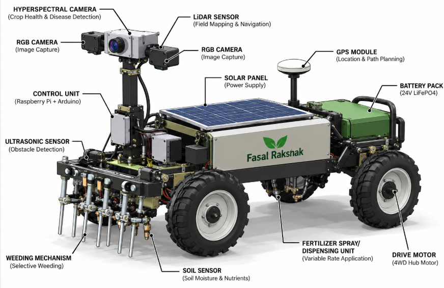

<p align="center">
  
</p>

<h1 align="center">🌾 Fasal Rakshak</h1>
<p align="center">
  <strong>Adaptive Hyperspectral Food Safety & Contamination Detection System</strong>
</p>
<p align="center">
  <em>Smart India Hackathon 2026 · Problem Statement 1788 · Team Tech Saarthi</em>
</p>

<p align="center">
  
  
  
  
  
</p>

---

## Overview

**Fasal Rakshak** is an AI-powered crop health inspection and contamination detection prototype. It demonstrates a mobile four-wheel hyperspectral rover that scans field rows, compares each surface against an adaptive clean baseline, and flags contamination risk before harvest reaches the next process.

### Key Features

- **Multi-Spectral Sensing** — HSI (400–1000 nm), NIR (900–1700 nm), UV (254–400 nm), and RGB capture synchronized in a single pass
- **Adaptive Clean Baseline** — The reference adapts to batch, variety, lighting, and field conditions — not a static threshold
- **Surface Response Map** — Progressive heatmap visualization showing spectral response intensity across a spatial grid
- **Edge AI Risk Scoring** — Risk classification runs locally on the rover with under 180 ms latency
- **Live Simulation** — Interactive 7-stage deterministic simulation from rover dispatch to action recording
- **Inspection Trace** — Every scan produces a full event stream for operator review and audit

---

##  Architecture

```
Fasal Rakshak System
├──  Rover Platform (4WD / IP65 / Solar + Battery)
│   ├── Raised HSI Camera Mast
│   ├── NIR / UV / RGB Sensors
│   ├── LiDAR + GPS Navigation
│   └── Edge AI Enclosure
│
├──  Sense → Decide → Act Pipeline
│   ├── Synchronized spectral capture
│   ├── Feature extraction & baseline comparison
│   ├── Spectral anomaly detection
│   └── Risk classification & action routing
│
└──  Operator Console (this prototype)
    ├── Live inspection dashboard
    ├── Spectral health fingerprint charts
    ├── Surface response heatmap
    └── Traceable inspection workflow
```

---

## Project Structure

```
fasal-rakshak/
├── artifacts/
│   ├── fasal-rakshak/              # Main prototype UI (React + Vite)
│   │   ├── src/
│   │   │   ├── App.tsx             # Core application with all components
│   │   │   ├── index.css           # Design system & animations
│   │   │   └── components/ui/      # Reusable UI components (shadcn)
│   │   └── public/                 # Static assets (rover image)
│   │
│   ├── fasal-rakshak-deck-reference/  # Presentation deck builder
│   ├── api-server/                    # API server scaffold
│   └── mockup-sandbox/               # Design mockup sandbox
│
├── lib/                            # Shared libraries
│   ├── api-client-react/           # React API client hooks
│   ├── api-spec/                   # API specification (OpenAPI)
│   ├── api-zod/                    # Zod validation schemas
│   └── db/                         # Database schema & migrations
│
├── scripts/                        # Build & dev scripts
├── pnpm-workspace.yaml             # Monorepo workspace config
├── tsconfig.base.json              # Shared TypeScript config
└── package.json                    # Root package
```

---

## Getting Started

### Prerequisites

- [Node.js](https://nodejs.org/) v18+
- [pnpm](https://pnpm.io/) v9+ (`npm install -g pnpm`)

### Installation

```bash
# Clone the repository
git clone https://github.com/codetanmay26-lang/fasal-rakshak.git
cd fasal-rakshak

# Install dependencies
pnpm install

# Approve build scripts (first time only)
pnpm approve-builds esbuild
```

### Running the Prototype

```bash
# Start the main inspection console
cd artifacts/fasal-rakshak
pnpm dev
```

Open **http://localhost:5173** in your browser.

### How to Use

1. Scroll to the **Live Inspection** section
2. Click **"Simulate Anomaly"** to start a 7-stage inspection pass
3. Watch the rover animate across the field scanning crop items
4. Observe the **Surface Response Map** build progressively
5. Click **"Inspection Trace Map"** to expand the workflow stages
6. Track events in the **Inspection Trace** panel

---

## Design System

The interface uses a curated agricultural-inspired palette:

| Token | Color | Usage |
|-------|-------|-------|
| **Forest Green** | `#245e4c` | Primary brand, headings |
| **Harvest Gold** | `#c79c3a` | Accents, active states, scan beam |
| **Teal** | `#4e9b85` | Pass/clean states, baselines |
| **Terra Cotta** | `#c56c48` | Risk/anomaly warnings |
| **Parchment** | `#ecebdc` | Background surfaces |

**Typography:**
- Display: Barlow Condensed
- Body: Manrope
- Mono: DM Mono

---

## Inspection Workflow (7 Stages)

| Stage | Process | Description |
|-------|---------|-------------|
| **01** | Rover Navigation | 4WD chassis follows mapped route with LiDAR + GPS |
| **02** | Spectral Capture | HSI, NIR, UV, RGB cameras capture synchronized frames |
| **03** | Feature Extraction | Edge preprocessing isolates surface response features |
| **04** | Baseline Comparison | Current response compared against adaptive clean reference |
| **05** | Anomaly Detection | Correlated surface + spectral anomaly cluster flagged |
| **06** | Risk Classification | Edge AI produces contamination-risk classification |
| **07** | Result & Action | Inspection trace records PASS or hold-for-review |

---

## Tech Stack

| Layer | Technology |
|-------|-----------|
| **Frontend** | React 19, TypeScript 5.9 |
| **Build** | Vite 7, pnpm workspaces |
| **Styling** | Tailwind CSS 4, CSS animations |
| **Charts** | Recharts, custom SVG sparklines |
| **Icons** | Lucide React |
| **UI Components** | Radix UI primitives (shadcn/ui) |
| **Validation** | Zod, TypeBox |
| **API** | Hono (server), Orval (client gen) |


---

## Team Tech Saarthi

Built for **Smart India Hackathon 2026**
- **Problem Statement:** 1788 — Food Safety & Contamination Detection
- **Domain:** Agriculture · FoodTech · Rural Development

---

<p align="center">
  <sub>Made with 🌱 for Indian agriculture</sub>
</p>
